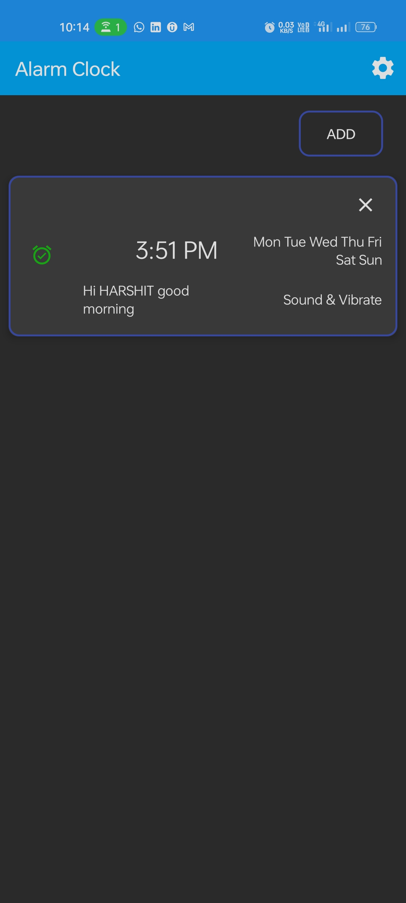
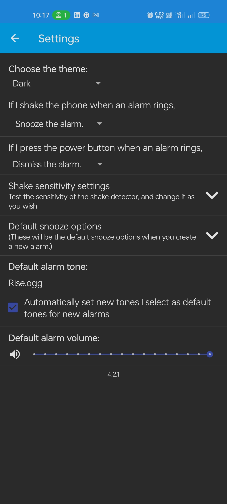

# Task: 3 CodSoft App Development Internship

# Alarm Clock

## AlarmClock logo : 

<i>An alarm clock app for Android which allows you to dismiss the ringing alarm by shaking the phone.</i>

Tired of pressing the power button/swiping the screen every time an alarm rings? Does your phone's UI have a tendency to freeze, thereby making it impossible to dismiss an alarm? No worries! You have come to the right place. With this app, you can simply shake your phone and dismiss the alarm.

## Salient features:

1. Works offline.
2. No advertisements.
3. Alarms are unique by alarm time. This means that you cannot have two alarms at the same time, even if they are on different dates.
4. Each alarm is independent of other alarms. This means that the alarm volume, ringtone, etc. will not be carried over to another alarm unless you do so manually.
5. Inbuilt dark theme, even in phones that do not support it.
6. Snooze your alarm as many times as you want with custom snooze options.
7. The alarm is handled by a Service which has almost no dependency on the UI. So, even if your UI freezes, the alarm will ring and can be dismissed.
8. Uses latest Android Room database for storing alarms.
9. Actively maintained app. Bug reports will be worked upon with high priority.

## Screenshots :

  
  
  
  
  
  

#AppDevelopment #Productivity #AlarmClock #CodeSoft
