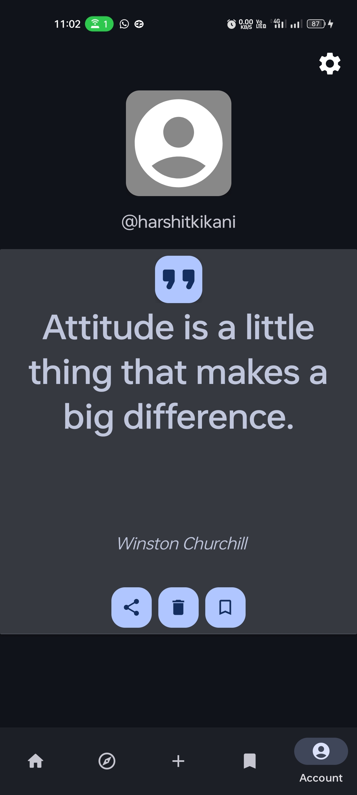

<h1 align="center">myQuotes</h1>
<h3 align="center">Share, Discover and Save New Quotes!</h3>

 <a href="https://github.com/lukassobotik/Quotes/blob/master/PrivacyPolicy.md">Privacy Policy</a> | <a href="https://github.com/lukassobotik/Quotes/blob/master/LICENSE">License</a>

## Overview

Manage your favorite quotes with ease! myQuotes is fully free and open-source.
It helps you organize your own inspirational quote collections. Easily create custom collections or add quotes to existing ones.
The search function lets you quickly locate any quote.

Enjoy the freedom to request, view, and delete all your stored data, ensuring transparency and control.

If you're looking for inspiration, the app has around 1500 quotes waiting for you to discover.
You can easily browse through them with an endless scroll feature, similar to Youtube Shorts or Instagram Reels.
When you find a quote you love, you can share it with others, so they can enjoy it too.

## What Data Is Being Stored?

Your Data Is Stored in Two Places:

1. Your Account Info (Email and Password) gets Stored with [Firebase Auth](https://firebase.google.com/docs/auth)
2. Everything else gets Stored in [Firebase Realtime Database](https://firebase.google.com/docs/database)

To view what data is stored about you, visit the [myQuotes Account Management Website](https://myquotes.account.lukassobotik.dev/stored-data)

## Screenshots

    
    
    
    
    
    
    
    

